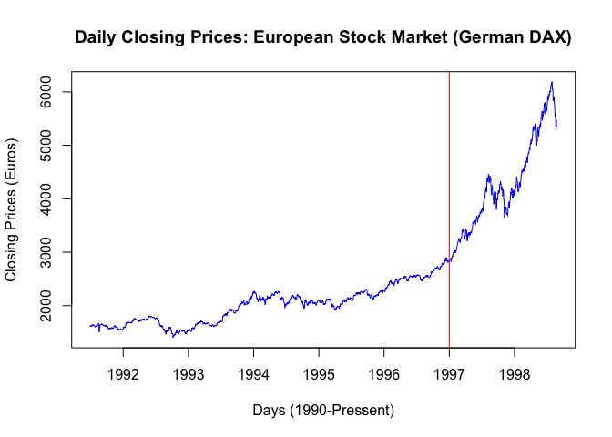
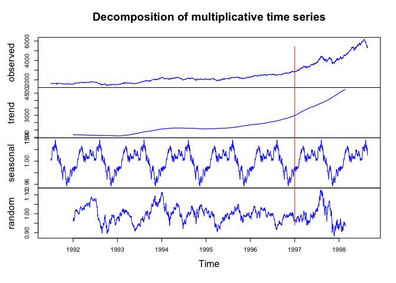
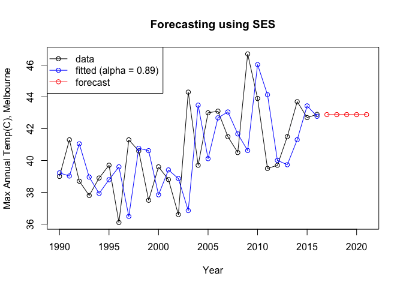
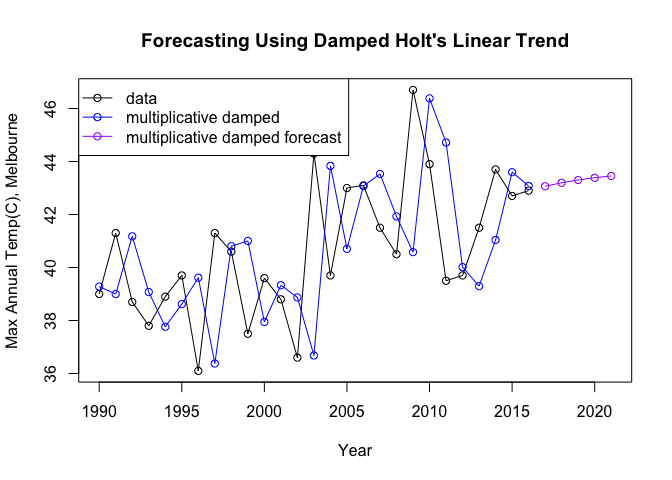

###### Data can be found at https://github.com/amylovesdogs/SMU-MSDS-Homework/tree/master/homework/Unit11HW

#### European Stock Exchange Prices

```r
library(dplyr)
```

```
## 
## Attaching package: 'dplyr'
```

```
## The following objects are masked from 'package:stats':
## 
##     filter, lag
```

```
## The following objects are masked from 'package:base':
## 
##     intersect, setdiff, setequal, union
```

```r
library(knitr)
library(ggplot2)
library(dygraphs)
library(xts)
```

```
## Warning: package 'xts' was built under R version 3.4.4
```

```
## Loading required package: zoo
```

```
## 
## Attaching package: 'zoo'
```

```
## The following objects are masked from 'package:base':
## 
##     as.Date, as.Date.numeric
```

```
## 
## Attaching package: 'xts'
```

```
## The following objects are masked from 'package:dplyr':
## 
##     first, last
```

```r
library(fpp2)
```

```
## Loading required package: forecast
```

```
## Loading required package: fma
```

```
## Loading required package: expsmooth
```

```r
# Question 1
# plot the DAX daily closing price from 1991 to present.
plot(EuStockMarkets[,"DAX"], main="Daily Closing Prices: European Stock Market (German DAX)", xlab="Days (1990-Pressent)", ylab="Closing Prices (Euros)", col="blue") 
abline(v = 1997, col="red")
```

<!-- -->

```r
# births <- ts(births, frequency = 12, start = c(1946, 1))
decomposed_stock <- decompose(EuStockMarkets[,"DAX"], type = "multiplicative")
plot(decomposed_stock, col = "blue")
abline(v = 1997, col="red")
```

<!-- -->

#### Maximum Annual Temperatures (Celsius) in Melbourne, Australia


```r
# Question 2
maxtemp_since1990 <- window(maxtemp,start=1990)

# forecast with SES
ses_fit <- ses(maxtemp_since1990,alpha=0.89,initial="optimal",h=5)
plot(ses_fit,PI=FALSE,ylab="Max Annual Temp(C), Melbourne",xlab="Year",main="Forecasting using SES",fcol="white",type="o")
lines(fitted(ses_fit),col="blue",type="o")
lines(ses_fit$mean,col="red",type="o")
legend("topleft", lty=1, col=c(1,"blue","red"), c("data", "fitted (alpha = 0.89)","forecast"),pch=1)
```

<!-- -->

```r
ses_aicc <- ses_fit$model$aicc

#forecast with Holt's linear trend
holt_mult_damped <- holt(maxtemp_since1990, alpha=0.8, beta=0.2, initial="optimal", exponential=TRUE, h=5, damped=TRUE)
plot(holt_mult_damped,PI=FALSE,ylab="Max Annual Temp(C), Melbourne",xlab="Year",main="Forecasting Using Damped Holt's Linear Trend",fcol="white",type="o")
lines(fitted(holt_mult_damped),col="blue",type="o")
lines(holt_mult_damped$mean,col="purple",type="o")
legend("topleft", lty=1, col=c(1,"blue","purple"), c("data","multiplicative damped", "multiplicative damped forecast"),pch=1)
```

<!-- -->

```r
holt_aicc <- holt_mult_damped$model$aicc

if (holt_aicc < ses_aicc) {
best_method <- "Damped Holt Linear Trend"
best_score <- holt_aicc
lesser_method <- "Simple Exponential Smoothing"
lesser_score <- ses_aicc
} else {
best_method <- "Simple Exponential Smoothing"
best_score <- ses_aicc
lesser_method <- "Damped Holt Linear Trend"
lesser_score <- holt_aicc
}
options(digits = 1)
```

###### The Simple Exponential Smoothing model was a better predictor than the Damped Holt Linear Trend model, with an AICc score of 150.4 versus 159.4.

#### Wand Sales (Gregorovitch vs. Ollivander)


```r
# Question 3
# Read in wand buying data from Gregorovitch and convert to time series
gregorovitch <- read.csv("Unit11TimeSeries_Gregorovitch.csv", na.strings = "", strip.white = TRUE)
names(gregorovitch) <- c("Date","Gregorovitch")
greg_ts <- xts(gregorovitch[,-1], order.by=as.Date(gregorovitch[,1], "%m/%d/%Y"))

# Read in wand buying data from Ollivander and convert to time series
ollivander <- read.csv("Unit11TimeSeries_Ollivander.csv", na.strings = "", strip.white = TRUE)
names(ollivander) <- c("Date","Ollivander")
ollie_ts <- xts(ollivander[,-1], order.by=as.Date(ollivander[,1], "%m/%d/%Y"))

wands_sold <- cbind(greg_ts, ollie_ts)
names(wands_sold) <- c("Gregorovitch","Ollivander")
dygraph(wands_sold, main = "Wand Sales", xlab = "Years", ylab = "Number of Wands Sold") %>% dySeries("Gregorovitch", label="Gregorovitch", color="red") %>% dySeries("Ollivander", label="Ollivander", color="blue")  %>% dyLegend(show = "always", hideOnMouseOut = FALSE) %>% dyOptions(stackedGraph = TRUE) %>% dyShading(from="1995-1-1", to="1999-12-31", color="#CCEBD6") %>% dyRangeSelector() %>% dyHighlight(highlightSeriesOpts = list(strokeWidth=3))
```

<!--html_preserve--><div id="htmlwidget-88a0b09f235271f60fe2" style="width:672px;height:480px;" class="dygraphs html-widget"></div>
<script type="application/json" data-for="htmlwidget-88a0b09f235271f60fe2">{"x":{"attrs":{"title":"Wand Sales","xlabel":"Years","ylabel":"Number of Wands Sold","labels":["year","Gregorovitch","Ollivander"],"retainDateWindow":false,"axes":{"x":{"pixelsPerLabel":60,"drawAxis":true},"y":{"drawAxis":true}},"series":{"Gregorovitch":{"axis":"y"},"Ollivander":{"axis":"y"}},"colors":["red","blue"],"legend":"always","labelsDivWidth":250,"labelsShowZeroValues":true,"labelsSeparateLines":false,"stackedGraph":true,"fillGraph":false,"fillAlpha":0.15,"stepPlot":false,"drawPoints":false,"pointSize":1,"drawGapEdgePoints":false,"connectSeparatedPoints":false,"strokeWidth":1,"strokeBorderColor":"white","colorValue":0.5,"colorSaturation":1,"includeZero":false,"drawAxesAtZero":false,"logscale":false,"axisTickSize":3,"axisLineColor":"black","axisLineWidth":0.3,"axisLabelColor":"black","axisLabelFontSize":14,"axisLabelWidth":60,"drawGrid":true,"gridLineWidth":0.3,"rightGap":5,"digitsAfterDecimal":2,"labelsKMB":false,"labelsKMG2":false,"labelsUTC":false,"maxNumberWidth":6,"animatedZooms":false,"mobileDisableYTouch":true,"showRangeSelector":true,"rangeSelectorHeight":40,"rangeSelectorPlotFillColor":" #A7B1C4","rangeSelectorPlotStrokeColor":"#808FAB","interactionModel":"Dygraph.Interaction.defaultModel","highlightCircleSize":3,"highlightSeriesBackgroundAlpha":0.5,"highlightSeriesOpts":{"strokeWidth":3},"hideOverlayOnMouseOut":true},"scale":"yearly","annotations":[],"shadings":[{"from":"1995-01-01T00:00:00.000Z","to":"1999-12-31T00:00:00.000Z","color":"#CCEBD6","axis":"x"}],"events":[],"format":"date","data":[["1971-01-01T00:00:00.000Z","1972-01-01T00:00:00.000Z","1973-01-01T00:00:00.000Z","1974-01-01T00:00:00.000Z","1975-01-01T00:00:00.000Z","1976-01-01T00:00:00.000Z","1977-01-01T00:00:00.000Z","1978-01-01T00:00:00.000Z","1979-01-01T00:00:00.000Z","1980-01-01T00:00:00.000Z","1981-01-01T00:00:00.000Z","1982-01-01T00:00:00.000Z","1983-01-01T00:00:00.000Z","1984-01-01T00:00:00.000Z","1985-01-01T00:00:00.000Z","1986-01-01T00:00:00.000Z","1987-01-01T00:00:00.000Z","1988-01-01T00:00:00.000Z","1989-01-01T00:00:00.000Z","1990-01-01T00:00:00.000Z","1991-01-01T00:00:00.000Z","1992-01-01T00:00:00.000Z","1993-01-01T00:00:00.000Z","1994-01-01T00:00:00.000Z","1995-01-01T00:00:00.000Z","1996-01-01T00:00:00.000Z","1997-01-01T00:00:00.000Z","1998-01-01T00:00:00.000Z","1999-01-01T00:00:00.000Z","2000-01-01T00:00:00.000Z","2001-01-01T00:00:00.000Z","2002-01-01T00:00:00.000Z","2003-01-01T00:00:00.000Z","2004-01-01T00:00:00.000Z","2005-01-01T00:00:00.000Z","2006-01-01T00:00:00.000Z","2007-01-01T00:00:00.000Z","2008-01-01T00:00:00.000Z","2009-01-01T00:00:00.000Z","2010-01-01T00:00:00.000Z","2011-01-01T00:00:00.000Z","2012-01-01T00:00:00.000Z","2013-01-01T00:00:00.000Z","2014-01-01T00:00:00.000Z","2015-01-01T00:00:00.000Z","2016-01-01T00:00:00.000Z","2017-01-01T00:00:00.000Z"],[1295,1349,1298,1493,1432,1431,1291,1247,1403,1188,1555,1512,1552,1023,1190,1197,1120,1119,1319,1692,1452,1494,1346,1519,1580,1623,1863,0,845,858,814,869,864,942,837,838,671,425,634,618,404,758,410,510,103,49,70],[1304,1168,1252,1296,1458,1443,1282,1450,1338,1063,1230,1237,1291,1211,1442,1649,1629,1260,1283,1617,1284,1399,1272,1297,1666,1797,1620,450,200,1308,1277,1444,1070,1031,1405,1487,1229,1493,1317,1520,1337,1547,1632,1336,1289,1439,1226]],"fixedtz":false,"tzone":"UTC"},"evals":["attrs.interactionModel"],"jsHooks":[]}</script><!--/html_preserve-->
