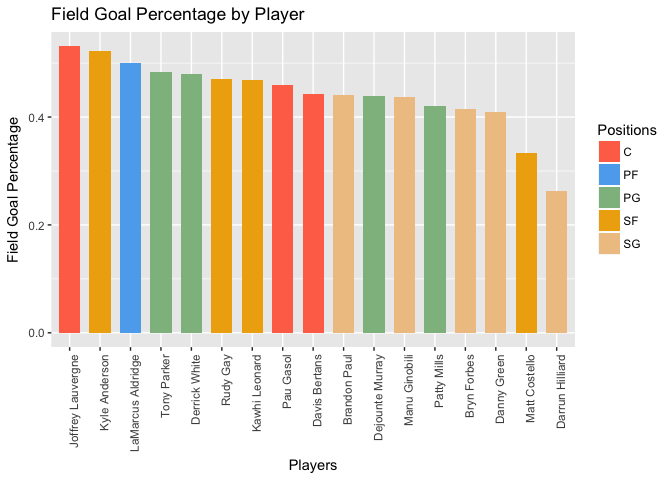

# Preparing Data
Amy Paschal  
3/3/2018  

### Harry Potter and the Dealthy Hallows: Part 2
#### Full Cast

```r
library(rvest)
```

```
## Loading required package: xml2
```

```r
library(xml2)
library(stringr)
library(knitr)
library(kableExtra)

# store words that can be the first word of a two-word last name
# words are defined as strings made up of non-blank characters
prefix_bank <- c("de","Van")

# splitName
# input: a vector of strings, each string is a word in a persons name
# output: a two dimentional vector, 
#    the first element is the a string of the first and middle names (i.e. all words not part of the last name)
#    the second element is a string of all words comprising the last name
# Properly hands multiple last names like 'de Juan' and 'Van Heusen'
splitName <- function(x) {
  num_names <- length(x)
  last_name <- x[num_names]
  leave_off <- c(num_names)
  # check for two-word last name
  if (num_names > 1 & x[num_names-1] %in% prefix_bank) {
      last_name <- paste(x[num_names-1], last_name, sep = " ")
      leave_off <- append(leave_off, num_names-1)
  }
  cbind(paste(x[-leave_off], collapse = " "), last_name)
}

# read in HMTL from the IMDB web site
IMDB_hp <- read_html("http://www.imdb.com/title/tt1201607/fullcredits?ref_=tt_ql_1")
actors_html <- html_nodes(IMDB_hp, xpath='//*[contains(concat( " ", @class, " " ), concat( " ", "itemprop", " " ))]//*[contains(concat( " ", @class, " " ), concat( " ", "itemprop", " " ))]')
characters_html <- html_nodes(IMDB_hp, xpath='//*[(@id = "fullcredits_content")]//div')

#Convert the actors and characters data to text
actor_data <- html_text(actors_html)
character_data <- html_text(characters_html)

# convert the actor data to a dataframe with FirstName and Surname columns
cast <- data.frame(t(sapply(strsplit(actor_data, " "), splitName)), stringsAsFactors = FALSE)
names(cast) <- c("FirstName","Surname")
         
# clean the character data
# remove new lines, extra white space, and anything in parentheses
character_data <- str_replace_all(html_text(characters_html), "[\r\n]" , "")
character_data <- str_replace_all(character_data, "\\s+" , " ")
character_data <- str_replace_all(character_data, "\\([^\\)]+\\)" , "")

# add the character information to the cast dataframe
cast$Character <- character_data

#display in a table
kable(cast, "markdown", row.names=FALSE, align="l", padding=2)
```


|FirstName                |Surname       |Character                                 |
|:------------------------|:-------------|:-----------------------------------------|
|Ralph                    |Fiennes       |Lord Voldemort                            |
|Michael                  |Gambon        |Professor Albus Dumbledore                |
|Alan                     |Rickman       |Professor Severus Snape                   |
|Daniel                   |Radcliffe     |Harry Potter                              |
|Rupert                   |Grint         |Ron Weasley                               |
|Emma                     |Watson        |Hermione Granger                          |
|Evanna                   |Lynch         |Luna Lovegood                             |
|Domhnall                 |Gleeson       |Bill Weasley                              |
|Clémence                 |Poésy         |Fleur Delacour                            |
|Warwick                  |Davis         |Griphook / Professor Filius Flitwick      |
|John                     |Hurt          |Ollivander                                |
|Helena Bonham            |Carter        |Bellatrix Lestrange                       |
|Graham                   |Duff          |Death Eater                               |
|Anthony                  |Allgood       |Gringotts' Guard                          |
|Rusty                    |Goffe         |Aged Gringotts' Goblin                    |
|Jon                      |Key           |Bogrod                                    |
|Kelly                    |Macdonald     |Helena Ravenclaw                          |
|Jason                    |Isaacs        |Lucius Malfoy                             |
|Helen                    |McCrory       |Narcissa Malfoy                           |
|Tom                      |Felton        |Draco Malfoy                              |
|Ian                      |Peck          |Hogsmeade Death Eater                     |
|Benn                     |Northover     |Hogsmeade Death Eater                     |
|Ciarán                   |Hinds         |Aberforth Dumbledore                      |
|Hebe                     |Beardsall     |Ariana Dumbledore                         |
|Matthew                  |Lewis         |Neville Longbottom                        |
|Devon                    |Murray        |Seamus Finnigan                           |
|Jessie                   |Cave          |Lavender Brown                            |
|Afshan                   |Azad          |Padma Patil                               |
|Isabella                 |Laughland     |Leanne                                    |
|Anna                     |Shaffer       |Romilda Vane                              |
|Georgina                 |Leonidas      |Katie Bell                                |
|Freddie                  |Stroma        |Cormac McLaggen                           |
|Alfred                   |Enoch         |Dean Thomas                               |
|Katie                    |Leung         |Cho Chang                                 |
|William                  |Melling       |Nigel                                     |
|Sian Grace               |Phillips      |Screaming Girl                            |
|Bonnie                   |Wright        |Ginny Weasley                             |
|Ralph                    |Ineson        |Amycus Carrow                             |
|Suzanne                  |Toase         |Alecto Carrow                             |
|Maggie                   |Smith         |Professor Minerva McGonagall              |
|Jim                      |Broadbent     |Professor Horace Slughorn                 |
|Scarlett                 |Byrne         |Pansy Parkinson                           |
|Josh                     |Herdman       |Gregory Goyle                             |
|Louis                    |Cordice       |Blaise Zabini                             |
|Amber                    |Evans         |Twin Girl 1                               |
|Ruby                     |Evans         |Twin Girl 2                               |
|Miriam                   |Margolyes     |Professor Pomona Sprout                   |
|Gemma                    |Jones         |Madam Pomfrey                             |
|George                   |Harris        |Kingsley Shacklebolt                      |
|David                    |Thewlis       |Remus Lupin                               |
|Julie                    |Walters       |Molly Weasley                             |
|Mark                     |Williams      |Arthur Weasley                            |
|James                    |Phelps        |Fred Weasley                              |
|Oliver                   |Phelps        |George Weasley                            |
|Chris                    |Rankin        |Percy Weasley                             |
|David                    |Bradley       |Argus Filch                               |
|Guy                      |Henry         |Pius Thicknesse                           |
|Nick                     |Moran         |Scabior                                   |
|Natalia                  |Tena          |Nymphadora Tonks                          |
|Phil                     |Wright        |Giant                                     |
|Garry                    |Sayer         |Giant                                     |
|Tony                     |Adkins        |Giant                                     |
|Dave                     |Legeno        |Fenrir Greyback                           |
|Penelope                 |McGhie        |Death Eater                               |
|Emma                     |Thompson      |Professor Sybil Trelawney                 |
|Ellie                    |Darcey-Alden  |Young Lily Potter                         |
|Ariella                  |Paradise      |Young Petunia Dursley                     |
|Benedict                 |Clarke        |Young Severus Snape                       |
|Leslie                   |Phillips      |The Sorting Hat                           |
|Alfie                    |McIlwain      |Young James Potter                        |
|Rohan                    |Gotobed       |Young Sirius Black                        |
|Geraldine                |Somerville    |Lily Potter                               |
|Adrian                   |Rawlins       |James Potter                              |
|Toby                     |Papworth      |Baby Harry Potter                         |
|Timothy                  |Spall         |Wormtail                                  |
|Robbie                   |Coltrane      |Rubeus Hagrid                             |
|Gary                     |Oldman        |Sirius Black                              |
|Peter G.                 |Reed          |Death Eater                               |
|Judith                   |Sharp         |Death Eater                               |
|Emil                     |Hostina       |Death Eater                               |
|Bob Yves Van Hellenberg  |Hubar         |Death Eater                               |
|Granville                |Saxton        |Death Eater                               |
|Tony                     |Kirwood       |Death Eater                               |
|Ashley                   |McGuire       |Death Eater                               |
|Arthur                   |Bowen         |Albus Severus Potter - 19 Years Later     |
|Daphne                   |de Beistegui  |Lily Potter - 19 Years Later              |
|Will                     |Dunn          |James Potter - 19 Years Later             |
|Jade                     |Gordon        |Astoria Malfoy - 19 Years Later           |
|Bertie                   |Gilbert       |Scorpius Malfoy - 19 Years Later          |
|Helena                   |Barlow        |Rose Weasley - 19 Years Later             |
|Ryan                     |Turner        |Hugo Weasley - 19 Years Later             |
|Jon                      |Campling      |Death Eater in Gringotts                  |
|Karen                    |Anderson      |Gringotts Goblin                          |
|Michael                  |Aston         |Wizard Parent                             |
|Michael Henbury          |Ballan        |Gringotts Goblin                          |
|Lauren                   |Barrand       |Gringotts Goblin                          |
|David                    |Barron        |Wizard with Dog in Painting               |
|Josh                     |Bennett       |Gringotts Goblin                          |
|Johann                   |Benét         |Deatheater                                |
|Sean                     |Biggerstaff   |Oliver Wood                               |
|Jada                     |Brevett       |Hogwarts Student                          |
|Ben                      |Champniss     |Parent                                    |
|Collet                   |Collins       |Snatcher                                  |
|Christoph                |Cordell       |Snatcher                                  |
|Christian                |Coulson       |Tom Marvolo Riddle                        |
|Gioacchino Jim           |Cuffaro       |Wizard Parent                             |
|Valerie                  |Dane          |Wizard Parent                             |
|Paul                     |Davies        |Deatheater                                |
|David                    |Decio         |Chief Snatcher                            |
|Ninette                  |Finch         |Augusta Longbottom                        |
|Grace Meurisse           |Francis       |Senior Gryffindor                         |
|Sean Francis             |George        |Wizard Parent                             |
|Diane                    |Gibbins       |Gringotts Goblin                          |
|Rich                     |Goble         |Death Eater                               |
|Hattie                   |Gotobed       |Young Girl in Epilogue                    |
|Melissa                  |Gotobed       |Hogwart's First Year Epilogue             |
|Ian                      |Hart          |Professor Quirinus Quirrell               |
|Stephen                  |Hawke         |Wedding Guest                             |
|David                    |Heyman        |Dining Wizard in Painting                 |
|Harper                   |Heyman        |Baby of Dining Wizard Family in Portrait  |
|Matthew                  |Hodgkin       |Hogwarts Student                          |
|Steven                   |Hopwood       |One-Legged Wizard                         |
|Joe                      |Kallis        |Death Eater                               |
|Gemma                    |Kayla         |Ravenclaw Senior                          |
|Hrvoje                   |Klecz         |Death Eater                               |
|Maxwell                  |Laird         |Gringotts Goblin                          |
|Debra                    |Leigh-Taylor  |Wizard Teacher                            |
|Christina                |Low           |Ravenclaw Student                         |
|Sarah                    |Lowe          |Ministry Wizard                           |
|Jonathan                 |Massahi       |Hogwarts Student                          |
|Tony                     |Montalbano    |Passenger                                 |
|Sha'ori                  |Morris        |Slytherin Girl                            |
|Luke                     |Newberry      |Teddy Lupin                               |
|Sarah Jane               |O'Neill       |Wizard Parent                             |
|Lisa                     |Osmond        |Gringotts Goblin                          |
|Elisabeth                |Roberts       |Death Eater                               |
|Keijo                    |Salmela       |Gringotts Goblin                          |
|Joshua                   |Savary        |Ravenclaw Student                         |
|Mark                     |Sealey        |Gringotts Goblin                          |
|Arti                     |Shah          |Gringotts Goblin                          |
|Glen                     |Stanway       |Death Eater                               |
|Albert                   |Tang          |Hogwarts Teacher                          |
|Richard                  |Trinder       |Augustus Rookwood                         |
|Nick                     |Turner        |Death Eater                               |
|Aaron                    |Virdee        |Gryffindor Senior                         |
|John                     |Warman        |Railway Station Porter                    |
|Spencer                  |Wilding       |Knight of Hogwarts                        |
|Amy                      |Wiles         |Slytherin Student                         |
|Thomas                   |Williamson    |Hogwarts Student                          |
#### Top Cast

```r
kable(head(cast,10), "markdown", row.names=FALSE, align="l", padding=2)
```


|FirstName  |Surname    |Character                             |
|:----------|:----------|:-------------------------------------|
|Ralph      |Fiennes    |Lord Voldemort                        |
|Michael    |Gambon     |Professor Albus Dumbledore            |
|Alan       |Rickman    |Professor Severus Snape               |
|Daniel     |Radcliffe  |Harry Potter                          |
|Rupert     |Grint      |Ron Weasley                           |
|Emma       |Watson     |Hermione Granger                      |
|Evanna     |Lynch      |Luna Lovegood                         |
|Domhnall   |Gleeson    |Bill Weasley                          |
|Clémence   |Poésy      |Fleur Delacour                        |
|Warwick    |Davis      |Griphook / Professor Filius Flitwick  |
### Shooting Statistics
#### San Antonio Spurs


```r
library(xml2)
library(ggplot2)

# read in HMTL from the IMDB web site
ESPN_spurs <- read_html("http://www.espn.com/nba/team/stats/_/name/sa/san-antonio-spurs")

# get the shooting stats table
stats_head_html <- xml_find_all(ESPN_spurs, xpath='//*[contains(concat( " ", @class, " " ), concat( " ", "stathead", " " ))]')
shooting_head <- stats_head_html[2]

# break the table in to header and rows, and get their count
rows_html <- xml_siblings(shooting_head) 
headers_html <- xml_children(rows_html[1])
headers <- sapply(headers_html, function(x) html_text(x))
num_stat_cols <- length(headers)
stat_rows <- rows_html[-c(1,length(rows_html))]
num_stat_rows <- length(stat_rows)

# make header cols into acceptable variable names
headers <- str_replace_all(headers, "%" , "P")
headers <- str_replace_all(headers, "3" , "Three")
headers <- str_replace_all(headers, "2" , "Two")

# strip the statistics rows of html
stats_html <- sapply(stat_rows, function(x) xml_children(x))
stat_list <- sapply(stats_html, function(x) html_text(x))

# format information into a data frame
stats_matrix <- matrix(stat_list, nrow = num_stat_rows, ncol = num_stat_cols, byrow = TRUE)
stats_df <- data.frame(stats_matrix, row.names = NULL, stringsAsFactors = FALSE)
names(stats_df) <- headers

# split the player and position into two columns
stats_df$POS <- str_replace_all(sapply(strsplit(stats_df$PLAYER, ","), "[[", 2),"\\s+","")
stats_df$PLAYER <- sapply(strsplit(stats_df$PLAYER, ","), "[[", 1)
#reorder columns
stats_df <- stats_df[c(headers[1],"POS",headers[-1])]

# convert numeric types to numeric
stats_df$FGM <- as.numeric(stats_df$FGM)
stats_df$FGA <- as.numeric(stats_df$FGA)
stats_df$FGP <- as.numeric(stats_df$FGP)
stats_df$ThreePM <- as.numeric(stats_df$ThreePM)
stats_df$ThreePA <- as.numeric(stats_df$ThreePA)
stats_df$ThreePP <- as.numeric(stats_df$ThreePP)
stats_df$FTM <- as.numeric(stats_df$FTM)
stats_df$FTA <- as.numeric(stats_df$FTA)
stats_df$FTP <- as.numeric(stats_df$FTP)
stats_df$TwoPM <- as.numeric(stats_df$TwoPM)
stats_df$TwoPA <- as.numeric(stats_df$TwoPA)
stats_df$TwoPP <- as.numeric(stats_df$TwoPP)
stats_df$PPS <- as.numeric(stats_df$PPS)
stats_df$AFGP <- as.numeric(stats_df$AFGP)


str(stats_df)
```

```
## 'data.frame':	17 obs. of  16 variables:
##  $ PLAYER : chr  "LaMarcus Aldridge" "Kawhi Leonard" "Rudy Gay" "Pau Gasol" ...
##  $ POS    : chr  "PF" "SF" "SF" "C" ...
##  $ FGM    : num  8.7 5.8 4.3 4 3.3 3.3 3.3 3.8 3.2 3.1 ...
##  $ FGA    : num  17.5 12.3 9.1 8.6 8 7.6 8.1 7.9 6.1 7.1 ...
##  $ FGP    : num  0.5 0.468 0.47 0.46 0.42 0.437 0.409 0.483 0.523 0.439 ...
##  $ ThreePM: num  0.4 1.2 0.7 0.7 1.8 1 1.8 0.1 0.2 0.1 ...
##  $ ThreePA: num  1.3 3.9 2.1 1.7 4.8 3.2 4.6 0.7 0.7 0.3 ...
##  $ ThreePP: num  0.321 0.314 0.333 0.382 0.379 0.327 0.385 0.192 0.297 0.238 ...
##  $ FTM    : num  4.3 3.4 2.1 2.2 1.2 1.6 0.7 1 1.6 1.2 ...
##  $ FTA    : num  5.2 4.2 2.7 2.8 1.4 1.9 0.9 1.5 2.1 1.6 ...
##  $ FTP    : num  0.84 0.82 0.78 0.76 0.88 0.86 0.78 0.67 0.74 0.73 ...
##  $ TwoPM  : num  8.3 4.6 3.6 3.3 1.5 2.3 1.5 3.7 3 3 ...
##  $ TwoPA  : num  16.2 8.4 7 6.9 3.2 4.4 3.5 7.2 5.4 6.8 ...
##  $ TwoPP  : num  0.514 0.539 0.511 0.479 0.485 0.516 0.44 0.511 0.551 0.449 ...
##  $ PPS    : num  1.27 1.31 1.25 1.25 1.22 ...
##  $ AFGP   : num  0.51 0.52 0.51 0.5 0.54 0.51 0.52 0.49 0.54 0.45 ...
```

```r
#display in a table
kable(stats_df, "markdown", row.names=FALSE, align="l", padding=2)
```


|PLAYER             |POS  |FGM  |FGA   |FGP    |ThreePM  |ThreePA  |ThreePP  |FTM  |FTA  |FTP   |TwoPM  |TwoPA  |TwoPP  |PPS    |AFGP  |
|:------------------|:----|:----|:-----|:------|:--------|:--------|:--------|:----|:----|:-----|:------|:------|:------|:------|:-----|
|LaMarcus Aldridge  |PF   |8.7  |17.5  |0.500  |0.4      |1.3      |0.321    |4.3  |5.2  |0.84  |8.3    |16.2   |0.514  |1.272  |0.51  |
|Kawhi Leonard      |SF   |5.8  |12.3  |0.468  |1.2      |3.9      |0.314    |3.4  |4.2  |0.82  |4.6    |8.4    |0.539  |1.315  |0.52  |
|Rudy Gay           |SF   |4.3  |9.1   |0.470  |0.7      |2.1      |0.333    |2.1  |2.7  |0.78  |3.6    |7.0    |0.511  |1.246  |0.51  |
|Pau Gasol          |C    |4.0  |8.6   |0.460  |0.7      |1.7      |0.382    |2.2  |2.8  |0.76  |3.3    |6.9    |0.479  |1.247  |0.50  |
|Patty Mills        |PG   |3.3  |8.0   |0.420  |1.8      |4.8      |0.379    |1.2  |1.4  |0.88  |1.5    |3.2    |0.485  |1.222  |0.54  |
|Manu Ginobili      |SG   |3.3  |7.6   |0.437  |1.0      |3.2      |0.327    |1.6  |1.9  |0.86  |2.3    |4.4    |0.516  |1.223  |0.51  |
|Danny Green        |SG   |3.3  |8.1   |0.409  |1.8      |4.6      |0.385    |0.7  |0.9  |0.78  |1.5    |3.5    |0.440  |1.119  |0.52  |
|Tony Parker        |PG   |3.8  |7.9   |0.483  |0.1      |0.7      |0.192    |1.0  |1.5  |0.67  |3.7    |7.2    |0.511  |1.110  |0.49  |
|Kyle Anderson      |SF   |3.2  |6.1   |0.523  |0.2      |0.7      |0.297    |1.6  |2.1  |0.74  |3.0    |5.4    |0.551  |1.336  |0.54  |
|Dejounte Murray    |PG   |3.1  |7.1   |0.439  |0.1      |0.3      |0.238    |1.2  |1.6  |0.73  |3.0    |6.8    |0.449  |1.056  |0.45  |
|Bryn Forbes        |SG   |2.8  |6.7   |0.414  |1.2      |3.2      |0.376    |0.5  |0.9  |0.61  |1.6    |3.5    |0.448  |1.087  |0.50  |
|Davis Bertans      |C    |2.3  |5.1   |0.443  |1.3      |3.5      |0.367    |0.6  |0.8  |0.80  |1.0    |1.6    |0.611  |1.259  |0.57  |
|Joffrey Lauvergne  |C    |2.0  |3.8   |0.531  |0.0      |0.1      |0.000    |0.7  |1.0  |0.65  |2.0    |3.7    |0.548  |1.235  |0.53  |
|Derrick White      |PG   |0.8  |1.6   |0.480  |0.3      |0.5      |0.500    |0.8  |1.1  |0.67  |0.5    |1.1    |0.471  |1.600  |0.56  |
|Brandon Paul       |SG   |0.9  |2.1   |0.440  |0.3      |0.9      |0.286    |0.4  |0.6  |0.61  |0.6    |1.2    |0.567  |1.193  |0.50  |
|Darrun Hilliard    |SG   |0.4  |1.4   |0.263  |0.0      |0.4      |0.000    |0.4  |0.5  |0.86  |0.4    |1.0    |0.385  |0.842  |0.26  |
|Matt Costello      |SF   |0.3  |1.0   |0.333  |0.0      |0.0      |0.000    |0.0  |0.0  |0.00  |0.3    |1.0    |0.333  |0.667  |0.33  |

```r
# sort by FGP descending in a way that makes ggplot happy
stats_df$PLAYER <- factor(stats_df$PLAYER, levels = stats_df$PLAYER[order(-stats_df$FGP)])

ggplot(data=stats_df, aes(x=PLAYER, y=FGP, fill=POS)) + geom_bar(stat="identity", width=.7) + theme(axis.text.x = element_text(angle = 90, hjust = 1)) + labs(title="Field Goal Percentage by Player", x ="Players", y = "Field Goal Percentage") + scale_fill_manual("Positions", values = c("PF" = "steelblue2", "SF" = "darkgoldenrod2", "C" = "coral1", "PG" ="darkseagreen", "SG" ="burlywood2"))
```

<!-- -->

```
